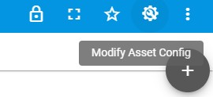
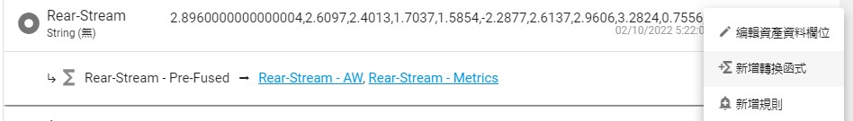
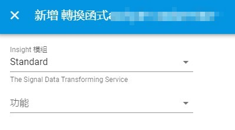
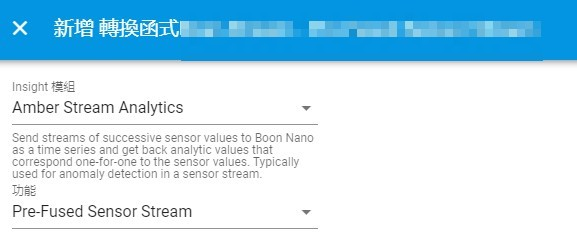
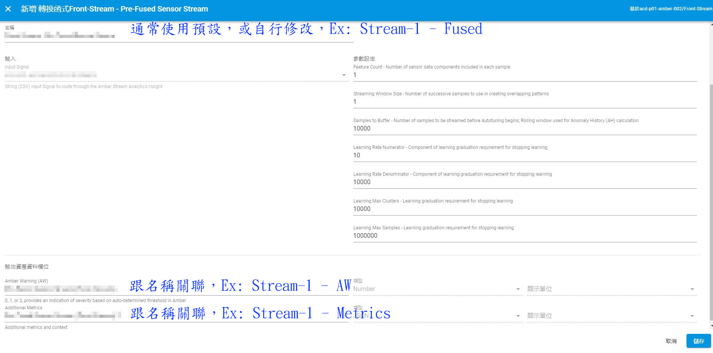
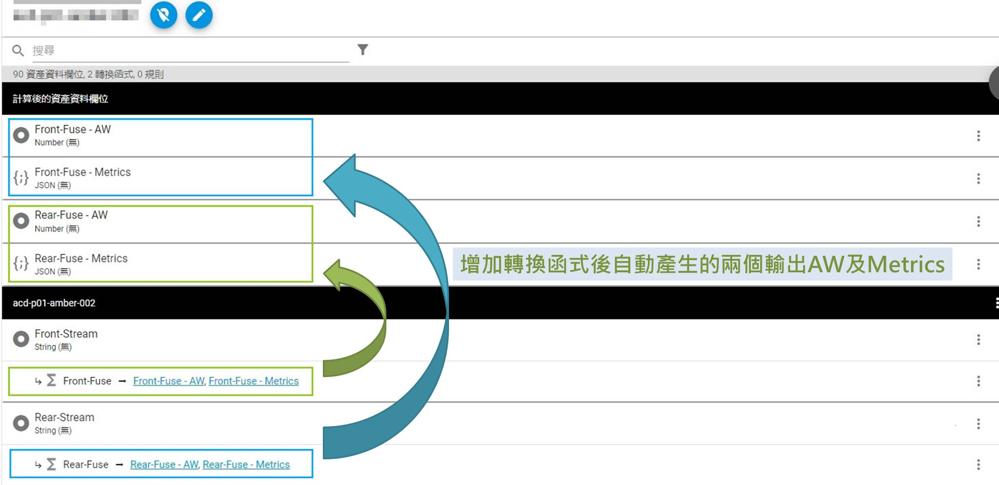
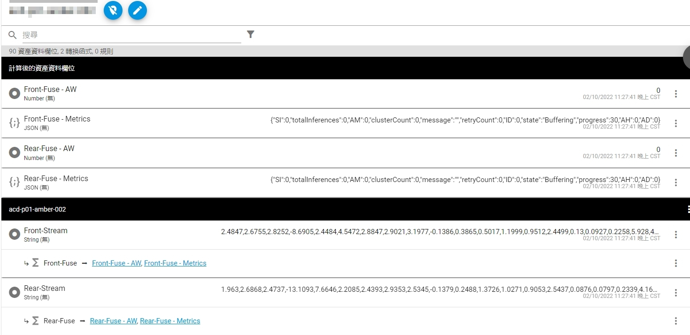

# Amber service deployment

**不討論Amber運作原理，僅說明如何部署Amber**

### 1. 儀錶板: 
**選擇一台資產(Asset)，點擊右上角的【修改資產設定】**

### 2. 資產設定:
**選擇一筆已整理的訊號，點擊【新增轉換函式】**

### 3. ExoSense Insight:
**選擇【Amber Stream Analytics】，接著選【Pre-Fused Sensor Stream】**

 

### 4. Amber參數調整:

**General**
- Feature Count: 輸入帶有多少個特徵值，以符號【,】區隔，中間不得有空格及多餘符號。
- Streaming Window Size: Pre Fused模式一律設定1

**Buffering & AutoTuning 階段**
- Samples To Buffer: 以多少樣本數當作訓練集，須注意，避免使用訊號已異常的樣本。

**Learning 階段**
- Learning Rate Numerator & Denominator: 當已上傳Denominator的樣本數量且cluster數量未超過Numerator即完成訓練。
- Learning Max Clusters: 當已上傳樣本數被分類超過設定數量即完成訓練。
- Learning Max Samples: 當已上傳樣本數超過設定數量即完成訓練。
- **P.S. 當滿足Learning Rate、Learning Max Clusters、Learning Max Samples三種其一條件都會完成訓練進入Monitoring階段**

### 5. Anber部署完成:

**示意圖為沒有任何資料上傳，此時AW & Metrics為空白**

### 6. 資料上傳 & Amber輸出觀察

- AW (Amber Warning): 0代表正常、1代表訊號發現有些微異常(95%)、2代表訊號極為異常(97%)。
- Metrics (僅說明重要參數)
  1. SI: 0-1000, 越靠近0代表訊號穩定，反之越靠近1000代表模型未見過此型態之訊號。
  2. totalInferences: 目前已上傳&推論過之樣本數
  3. clusterCount: 在Buffering & Learning階段已unsupervised方法所分類出的族群數量。
  4. ID: 當前訊號為哪一族群
  5. state: 目前階段，順序為 Buffering→AutoTuning→Learning→Monitoring
  6. AH (Anomaly History): 當AD連續為1之滾動次數
  7. AD (Anomaly Detection): 0為正常、1代表異常；勿跟AW搞混，AW為high-level的警報，若實作上AW一直不能及時反饋異常，可觀察AD是否已顯示為1，可透過AD及AH的提示來提早警報，不用等AW變成1或2，可能為時已晚。
  
